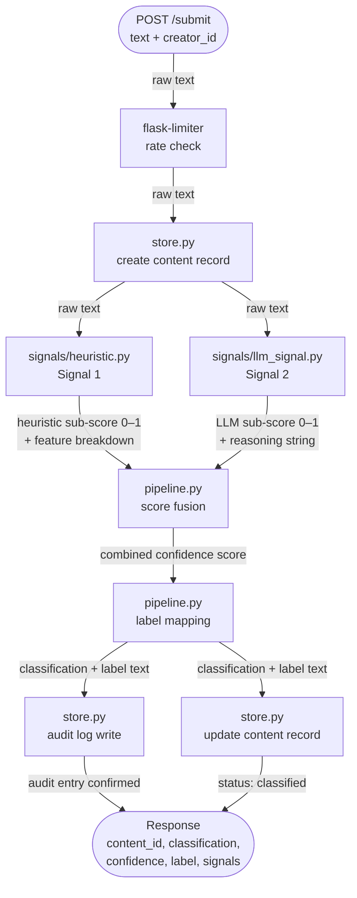
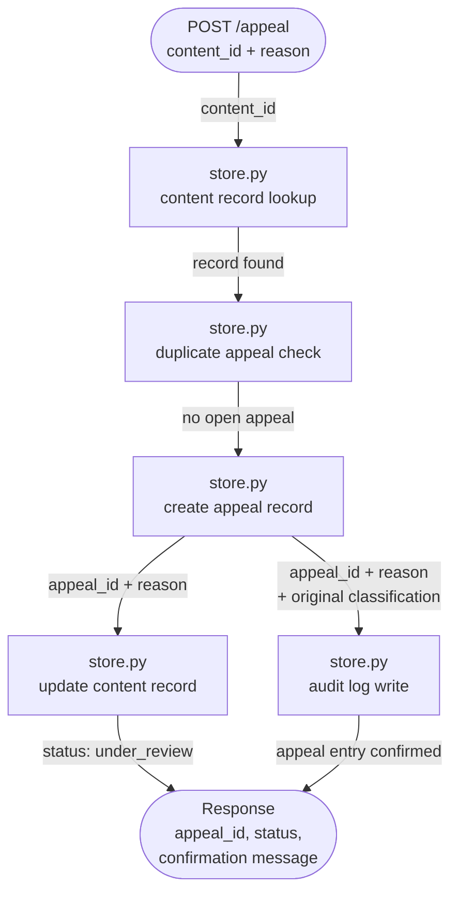
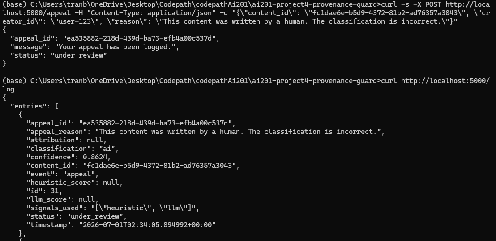
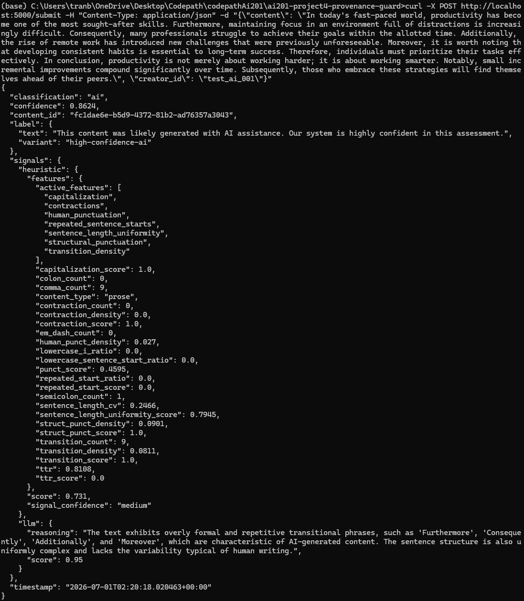
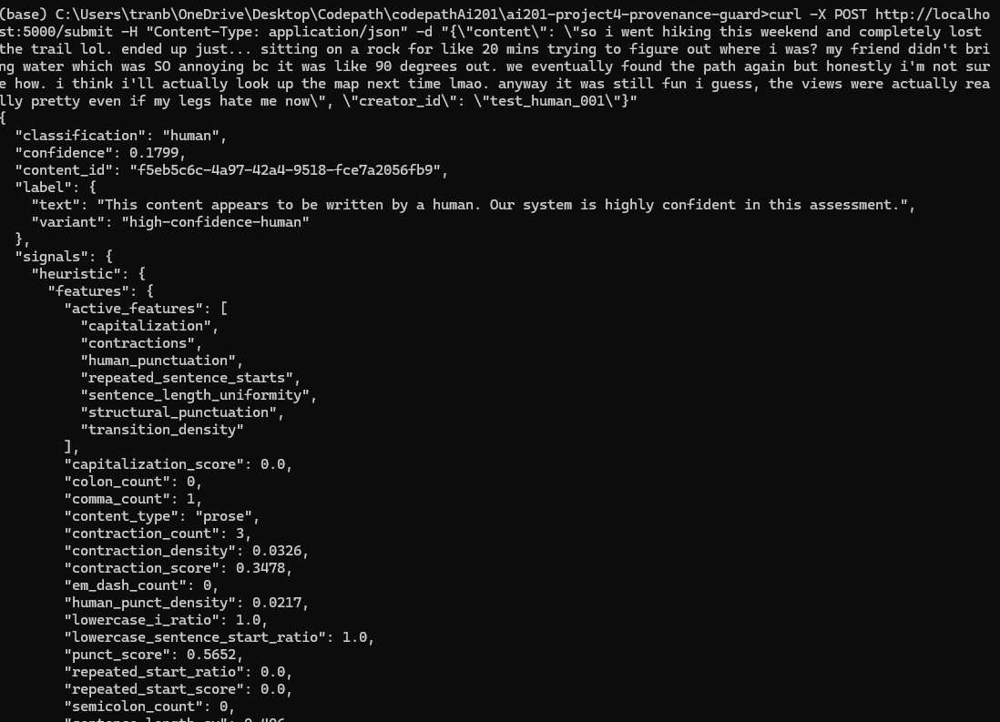
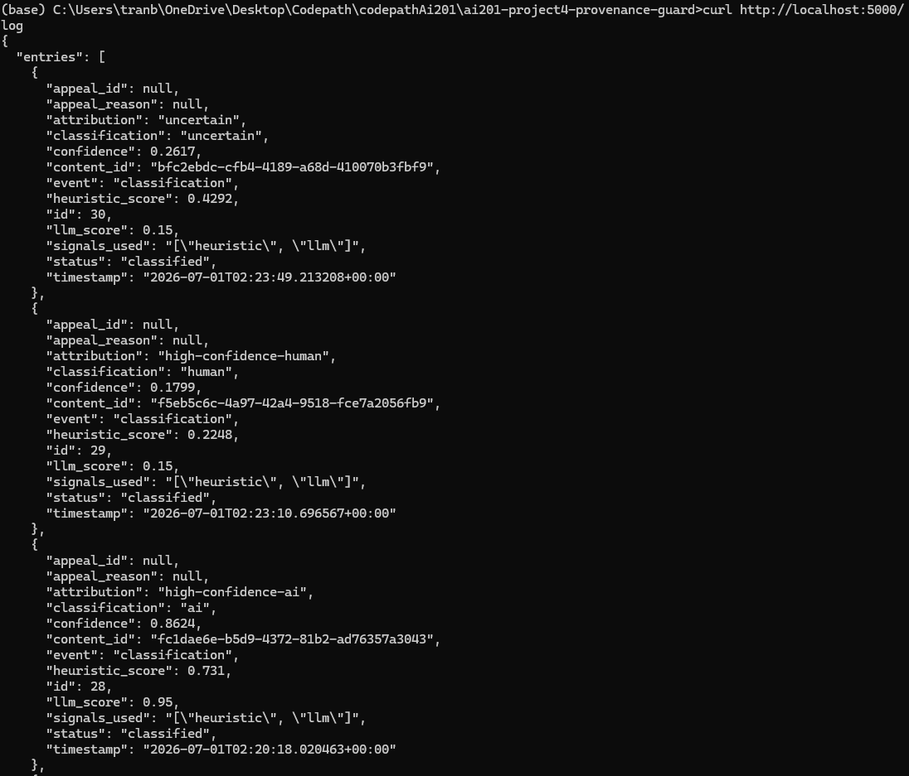
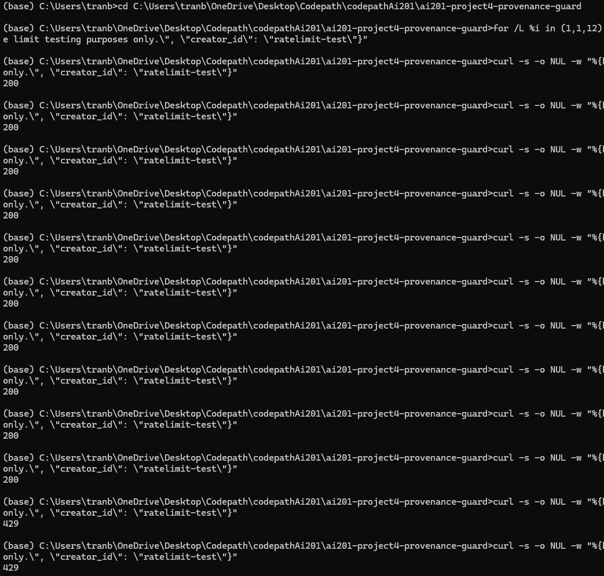

# Provenance-Guard

A Flask app that receives text submissions and runs two detection signals against them to see whether the content is AI genereated or not.

---

## Quickstart

**Prerequisites:** Python 3.10+

   **Create and activate a virtual environment**
   ```bash
   python -m venv .venv
   # macOS/Linux
   source .venv/bin/activate
   # Windows
   .venv\Scripts\activate
   ```

   **Install dependencies**
   ```bash
   pip install -r requirements.txt
   ```

   **Set up your Groq API key**

   Create a `.env` file in the project root:
   ```
   GROQ_API_KEY=your_key_here
   ```
   Get a free key (no credit card required) at [console.groq.com](https://console.groq.com).

   **Run the app**
   ```bash
   python app.py
   ```
   The server starts at `http://127.0.0.1:5000`.

   **Submit text for classification**
   ```bash
   curl -X POST http://127.0.0.1:5000/submit \
     -H "Content-Type: application/json" \
     -d '{"content": "your text here", "creator_id": "user1"}'
   ```

---

## Architecture Overview

### Flow 1 — Submission



**Step-by-step:**

**1. Request arrives at `POST /submit` (`app.py`)** — Flask validates that a non-empty `content` field is present. If missing, a `400` is returned immediately. The rate limiter then checks the caller's IP against its per-minute and per-hour counters before any analysis runs.

**2. Content record is created (`store.py`)** — A UUID is generated and an initial record is written to SQLite. This ID is the canonical identity for the content throughout its lifecycle — the audit log and appeal workflow both reference it.

**3. Heuristic signal runs (`signals/heuristic.py`)** — Eight stylometric features are measured and combined into a 0–1 AI-likelihood score. See [Detection Signals](#detection-signals).

**4. LLM signal runs (`signals/llm_signal.py`)** — The text is sent to Llama 3.3 70B via the Groq API. The model returns a classification and confidence value, which is converted into a 0–1 AI-likelihood score on the same scale as the heuristic.

**5. Scores are fused (`pipeline.py`)** — `confidence = 0.4 × heuristic + 0.6 × llm`. The LLM carries more weight because it reasons over semantics and tone rather than surface patterns.

**6. Classification and label are assigned (`pipeline.py`)** — The confidence value maps to one of three variants: `high-confidence-ai` (≥ 0.75), `high-confidence-human` (≤ 0.25), or `uncertain` (0.26–0.74). Each has a corresponding human-readable label text.

**7. Audit log is written (`store.py`)** — Every classification event — both signal scores, final confidence, attribution, and timestamp — is persisted. The content record status is updated to `"classified"`.

**8. Response is returned** — The API returns `content_id`, `classification`, `confidence`, full `label`, per-signal breakdowns with feature details, and the timestamp.

---

### Flow 2 — Appeal



**Step-by-step:**

**1. Appeal request arrives at `POST /appeal` (`app.py`)** — Flask validates that a JSON body is present and that both `content_id` and `reason` fields are non-empty. Missing either returns a `400` immediately.

**2. Content record is looked up (`store.py`)** — The provided `content_id` is checked against the database. If no matching record exists, a `404` is returned. This ensures appeals can only be filed against content that was actually submitted and classified.

**3. Duplicate appeal check runs (`store.py`)** — The system queries for any existing open appeal tied to the same `content_id`. If one is found, the request is rejected with a `409`. Only one appeal per piece of content is allowed at a time.

**4. Appeal record is created (`store.py`)** — A new UUID is generated for the appeal and a record is written to the database with the `content_id`, `creator_id`, reason text, and timestamp.

**5. Content record status is updated (`store.py`)** — The original content record's appeal status is set to `"under_review"` so downstream queries know this classification is being contested.

**6. Appeal event is written to the audit log (`store.py`)** — The appeal is logged as a separate event alongside the original classification event. The log entry carries the `appeal_id`, reason, original classification, and original confidence so the full decision trail is preserved in one place.

**7. Response is returned to the creator (`app.py`)** — The API returns the `appeal_id`, status `"under_review"`, and a confirmation message.

### Example Appeal




---

## Detection Signals

### Signal 1 — Heuristic (`signals/heuristic.py`)

A stylometric analyzer with eight features. Features are weighted by what I think would contribute more than others.

| Feature | What it measures | Why it matters | What it misses |
|---|---|---|---|
| **Transition density** | Frequency of formulaic connectors ("furthermore", "consequently", "notably") | AI models overuse these at rates rare in casual human writing | Academic human writing legitimately uses them |
| **Sentence-length uniformity** | Coefficient of variation across sentence lengths (prose only) | AI output tends toward uniform sentence rhythm; humans are erratic | Intentionally rhythmic human prose (journalism) may score high |
| **Type-token ratio (TTR)** | Unique words / total words (150+ word gate) | AI text on longer passages repeats vocabulary more than humans | Short texts are excluded — TTR is unreliable below ~150 words |
| **Structural punctuation** | Density of commas, em-dashes, colons, and semicolons | AI constructs complex subordinate clauses heavily; casual human writing is simpler | Technical or formal human writing uses the same constructs |
| **Human punctuation** | Density of hyphens, ellipses, `!`, and `?` | Expressive markers humans use erratically; AI avoids them | Dry human writing (reports, memos) also avoids them |
| **Contractions** | Frequency of `don't`, `I'm`, `it's`, etc. | Strong informality marker; AI formal prose avoids contractions | AI instructed to be casual may use them |
| **Capitalization irregularity** | Lowercase sentence starts and lowercase "i" | Humans texting or posting informally skip capitalization; AI almost never does | Deliberate stylistic choices by human writers |
| **Repeated sentence starts** | Ratio of repeated 2-word openers (4+ sentence gate) | AI often chains "This means… This allows… This creates…" | Humans using anaphora for intentional rhetorical effect |

I added a simple verse or prose content-type to fine tune my heuristic approach. For verse inputs, sentence-length uniformity is skipped because structural poems can be structured very differently than normal prose.

The signal also returns a `signal_confidence` field — `"low"` for texts under 80 words, `"medium"` for 80–249 words, and `"high"` for 250+. Short texts produce unstable feature values and should be weighted with caution.

---

### Signal 2 — LLM (`signals/llm_signal.py`)

Calls **Llama 3.3 70B** (via Groq) at `temperature=0.0` with a structured system prompt instructing the model to return exactly one JSON object with `classification`, `confidence`, and `reasoning` fields.

The model's `confidence` represents its certainty in its own classification label, not a raw AI-likelihood probability. The signal converts this to the pipeline's expected 0–1 AI-likelihood scale:
- If classified `"ai"`: `score = confidence`
- If classified `"human"`: `score = 1.0 - confidence`
- If classified `"uncertain"`: `score = 0.5`

On any failure (API error, malformed JSON, missing key), the signal falls back to `{"score": 0.5, "reasoning": "LLM signal unavailable: ..."}` so the pipeline always completes.

**What it misses:** The LLM signal reasons holistically over content and style, but it can be fooled by human text that happens to be formal, or AI text deliberately written to mimic a casual voice. It is also a black box — the `reasoning` field surfaces the model's explanation, but the score cannot be audited the way heuristic feature values can.

---

## Confidence Scoring

### Fusion formula

```
confidence = round(0.4 × heuristic_score + 0.6 × llm_score, 4)
```

The LLM has 60% of the weight because it evaluates semantics and argumentation style where heuristic signals may fail to identify. The heuristic weight is set to 40% because it is catches the patterns the LLM might not and to be frank I don't think my heuristic signals are polished enought to be reliable. That being said, both signals alone on their own aren't sufficient but having both would help capture patterns the other would otherwise miss.

### Validation

Both signals were manually validated against three purpose-built test submissions designed to stress-test the classification boundaries:

| Submission type | Heuristic score | LLM score | Fused confidence | Label |
|---|---|---|---|---|
| AI productivity essay | 0.731 | 0.95 | **0.8624** | `high-confidence-ai` |
| Human hiking story | 0.2248 | 0.15 | **0.1799** | `high-confidence-human` |
| Borderline climate opinion | 0.4292 | 0.15 | **0.2617** | `uncertain` |

The spread between the high-confidence AI (0.8624) and high-confidence human (0.1799) is 0.6825 — wide enough to show the signals are meaningfully discriminating and not collapsing toward the center.

### Example 1 — High-confidence AI (confidence: 0.8624)

**Input:**
> "In today's fast-paced world, productivity has become one of the most sought-after skills. Furthermore, maintaining focus in an environment full of distractions is increasingly difficult. Consequently, many professionals struggle to achieve their goals within the allotted time. Additionally, the rise of remote work has introduced new challenges... In conclusion, productivity is not merely about working harder; it is about working smarter. Notably, small incremental improvements compound significantly over time."

**Key signals:** 9 transition words (`transition_density: 0.0811`, `transition_score: 1.0`), 0 contractions (`contraction_score: 1.0`), perfect capitalization (`capitalization_score: 1.0`), high structural punctuation density (`struct_punct_score: 1.0`). LLM reasoning: *"The text exhibits overly formal and repetitive transitional phrases, such as 'Furthermore', 'Consequently', and 'Moreover', which are characteristic of AI-generated content. The sentence structure is also uniformly complex and lacks the variability typical of human writing."*



---

### Example 2 — High-confidence human (confidence: 0.1799)

**Input:**
> "so i went hiking this weekend and completely lost the trail lol. ended up just... sitting on a rock for like 20 mins trying to figure out where i was? my friend didn't bring water which was SO annoying bc it was like 90 degrees out. we eventually found the path again but honestly i'm not sure how. i think i'll actually look up the map next time lmao."

**Key signals:** 0 transition words, 3 contractions (`contraction_density: 0.0326`), all lowercase sentence starts (`lowercase_sentence_start_ratio: 1.0`), lowercase `i` throughout (`lowercase_i_ratio: 1.0`), `capitalization_score: 0.0`. LLM score dropped to 0.15 — the model recognized conversational language and emotional expression as strong human signals.



---

## Transparency Label

The label returned to callers is determined solely by the fused confidence value. All three variants are shown below with their exact text.

**`high-confidence-ai`** — confidence ≥ 0.75
```
"This content was likely generated with AI assistance. Our system is highly confident in this assessment."
```

**`high-confidence-human`** — confidence ≤ 0.25
```
"This content appears to be written by a human. Our system is highly confident in this assessment."
```

**`uncertain`** — confidence between 0.26 and 0.74
```
"Our system could not confidently determine whether this content was AI-generated or human-written. The classification is shown as uncertain."
```

The full label object returned by the API:

```json
"label": {
  "variant": "high-confidence-ai",
  "text": "This content was likely generated with AI assistance. Our system is highly confident in this assessment."
}
```

All submissions are written to the audit log and you can call it with `GET /log`. Here is an example.



---

## Rate Limiting

`POST /submit` is limited to 10 requests per minute and 100 requests per hour.

**Why 10/minute:** The Groq request has latency and usage costs. The endpoint needs a reasonable limit and I chose ten. Ten requests per minute is enough for a normal user submitting content interactively and can filter scripts from overwhelming the Groq API.

**Why 100/hour:** The hourly limit adds a second layer of protection against abuse. A script could stay under the limit by sending 9 requests every minute for an extended period of time which would bypass the first limit.

**Verification:** The limit was tested by firing 12 rapid requests in a loop. Requests 1–10 returned `200`; request 11 returned `429`. All subsequent requests in the same burst were also rejected.



Exceeding either limit returns HTTP `429 Too Many Requests`. The `/appeal` and `/log` endpoints are not rate-limited.

---

## Known Limitations

### Formal human writing scores as AI
The formal human-writing example definitely had some issues. Both the Heuristic and LLM flagged the content as AI. That's the nature of my heuristic features where capitalization and heavy use of structural punctuation could be mistaken as AI. Interestingly the LLM also agrees that the borderline case was AI generated so maybe I could improve the prompt in the future.

### Reverse Engineering the Detection
AI text deliberately prompted to sound informal for example using contractions, lowercase, and conversational filler would definitely bypass my heuristic signals. 

### Short Texts
Content under 80 words get `signal_confidence: low`. The stylometric features like TTR and repeated sentence starts cannot be measured because they are nulled out. But this should be the case becasue low text count is generally harder to classify because there isn't enough context to work with. A 10 word sentence is a lot harder to classify than say a 100 word one.

---

## Spec Reflection

### One way the spec helped

Defining all of the labels, label variants, and thresholds for the decisions made the implementation process straightforward. All I had to do was direct the AI to map the specified values to a decision.

### One way implementation diverged from the spec — and why

The spec originally set the confidence thresholds to **0.80 / 0.20** (scores above 0.80 = AI, below 0.20 = human). Testing it on various Claude generated examples deemed it too restrictive. The thresholds were ultimately set to **0.75 / 0.25** after validating that the known hard cases formal human prose and contraction-heavy marketing AI — still landed safely in `uncertain` at those values rather than producing a confident mislabel.

---

## AI Usage

### Instance 1 — Heuristic feature weights

I directed the AI to assign weights to the eight heuristic features in `heuristic.py`. The AI initially had an equal weights for each feature, giving `capitalization` and `human_punctuation` roughly the same weight as `transition_density` and `repeated_sentence_starts`. I overrode this based on my own judgment: transition density and repeated sentence starts are the two features most uniquely associated with AI writing and least likely to fire on legitimate human prose, so I pushed their weights higher (`transition_density: 0.20`, `repeated_sentence_starts: 0.16`) and reduced the weight of weaker signals like `capitalization` (0.06) and `human_punctuation` (0.08). I applied the same reasoning to the verse weight table separately, increasing `transition_density` to 0.25 since it is the only strong AI signal that still applies reliably to poetic content.

### Instance 2 — Removing burstiness and fixing double-counting

The AI's original heuristic implementation included two separate features for sentence-length variance: `sentence_length_uniformity` (coefficient of variation) and `burstiness` (a B = (σ - μ) / (σ + μ) formula). I identified that these two features were measuring the same underlying signal — how much sentence lengths vary — and that including both was double-counting the same evidence. I directed the AI to remove the burstiness feature entirely and keep only sentence-length uniformity, and also to tighten the CV threshold from 1.5 to 1.2 to compensate for the removed signal. The AI implemented the removal but introduced an indentation bug in the process — the `final_score` line lost its indent and became module-level code. I caught the error from the traceback and directed the AI to restore the correct indentation.


