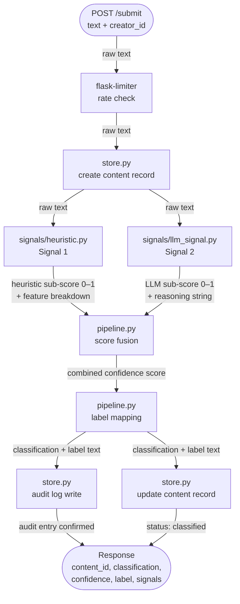
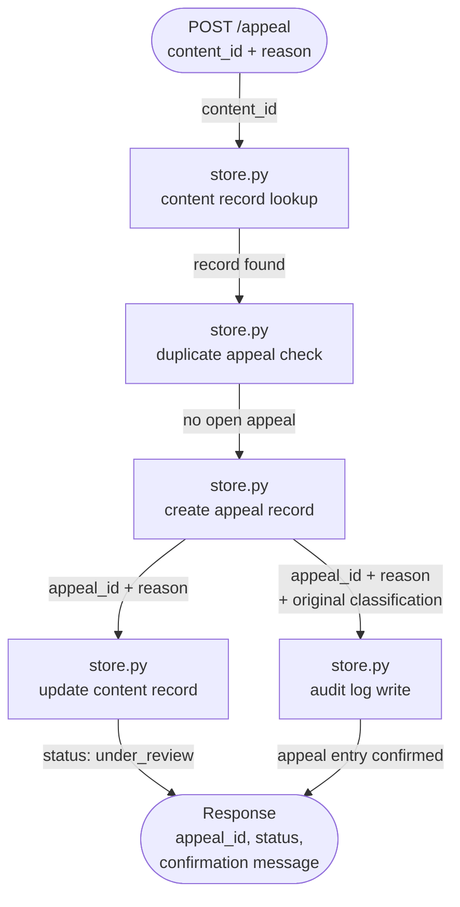

# Provenance Guard — Planning Document

## Project Overview

A backend API that classifies text content as AI-generated or human-written, scores confidence,
surfaces a transparency label, and handles creator appeals — designed to be plugged into any
creative sharing platform.

---

## Tech Stack

| Component | Tool | Notes |
|---|---|---|
| API framework | Flask | Free, lightweight |
| Detection signal 1 | Groq (`llama-3.3-70b-versatile`) | Free tier — same account as Projects 1–3 |
| Detection signal 2 | Stylometric heuristics | Pure Python, no external libraries needed |
| Rate limiting | Flask-Limiter | Free |
| Audit log | SQLite (built-in) or structured JSON | No additional setup |

---

## Detection Signals (Multi-Signal Pipeline)

The system combines two independent signals and weights them into a final confidence score.

### Signal 1 — Heuristic / Statistical Analysis
Computes measurable stylometric features directly from the text — no external calls needed.

Metrics captured:
- **Average sentence length** — AI tends toward uniform, moderate-length sentences
- **Vocabulary richness** (Type-Token Ratio) — AI output can have lower lexical diversity
- **Punctuation pattern variance** — humans use em-dashes, ellipses, and fragments more erratically
- **Burstiness** — humans write in bursts of short and long sentences; AI is more uniform

This signal is fast, deterministic, and provides an interpretable numeric sub-score.

### Signal 2 — LLM-Based Probabilistic Classification
Sends the content to Groq (`llama-3.3-70b-versatile`) with a structured prompt asking the model to assess the
likelihood that the passage was AI-generated and return a JSON object with:
- A classification (`"ai"` | `"human"` | `"uncertain"`)
- A confidence value (0.0–1.0)
- A brief reasoning string

This signal captures semantic patterns, phrasing style, and structural tells that heuristics miss.

### Score Fusion
Final confidence = weighted average of the two sub-scores:
```
final_score = 0.4 * heuristic_score + 0.6 * llm_score
```
The LLM signal is weighted higher because it captures more nuanced features. The heuristic acts
as a sanity check and ensures the system degrades gracefully if the LLM call fails.

---

## Confidence → Transparency Label Mapping

| Score Range | Classification | Label Text (shown to user) |
|---|---|---|
| ≥ 0.80 | High-confidence AI | "This content was likely generated with AI assistance. Our system is highly confident in this assessment." |
| ≤ 0.20 | High-confidence Human | "This content appears to be written by a human. Our system is highly confident in this assessment." |
| 0.21–0.79 | Uncertain | "Our system could not confidently determine whether this content was AI-generated or human-written. The classification is shown as uncertain." |

---

## Label Variants

There are exactly three label variants. Each has a machine-readable `variant` key used in the API response, an internal classification value, the score range that triggers it, and the exact text shown to the reader.

---

### Variant: `"high-confidence-ai"`

- **Triggers when:** confidence score ≥ 0.80
- **Internal classification:** `"ai"`
- **Display text:** "This content was likely generated with AI assistance. Our system is highly confident in this assessment."
- **What it communicates:** The system examined the text across both signals and both agreed strongly that the writing patterns, vocabulary, and structure are consistent with AI-generated output. The reader is told directly, not hedged.

---

### Variant: `"high-confidence-human"`

- **Triggers when:** confidence score ≤ 0.20
- **Internal classification:** `"human"`
- **Display text:** "This content appears to be written by a human. Our system is highly confident in this assessment."
- **What it communicates:** Both signals returned low AI-likelihood scores. The text shows the kind of irregularity, burstiness, and stylistic idiosyncrasy the system associates with human writing. The reader is given a positive human attribution, not just the absence of an AI flag.

---

### Variant: `"uncertain"`

- **Triggers when:** confidence score is between 0.21 and 0.79 (inclusive)
- **Internal classification:** `"uncertain"`
- **Display text:** "Our system could not confidently determine whether this content was AI-generated or human-written. The classification is shown as uncertain."
- **What it communicates:** The signals did not agree strongly enough to commit to either attribution. This is an honest statement of system uncertainty — it does not assert AI, it does not clear the content as human. It is also the variant most likely to surface in an appeal, since creators whose work was genuinely human-written but stylistically regular will land here rather than in `"high-confidence-ai"`.

---

**Key rule:** the `variant` is determined entirely by the final fused confidence score. A piece of content cannot be classified internally as `"ai"` but receive the `"uncertain"` variant — the classification field always matches the variant. If the score is 0.74, both the `classification` field and the `label.variant` field reflect `"uncertain"`, not `"ai"`.

---

## API Endpoints

### POST /submit
Accepts text content, runs the detection pipeline, returns classification + confidence + label.

Request body:
```json
{ "content": "...", "creator_id": "optional-string" }
```

Response:
```json
{
  "content_id": "uuid",
  "classification": "ai | human | uncertain",
  "confidence": 0.87,
  "label": { "variant": "high-confidence-ai", "text": "..." },
  "signals": {
    "heuristic": { "score": 0.82, "features": {} },
    "llm": { "score": 0.90, "reasoning": "..." }
  },
  "timestamp": "ISO8601"
}
```

### POST /appeal
Lets a creator contest a classification.

Request body:
```json
{ "content_id": "uuid", "creator_id": "string", "reason": "string" }
```

Response:
```json
{ "appeal_id": "uuid", "status": "under_review", "message": "Your appeal has been logged." }
```

### GET /log
Returns the full structured audit log (all decisions + appeals).

Response:
```json
{
  "event": "classification | appeal",
  "content_id": "uuid",
  "timestamp": "ISO8601",
  "classification": "ai | human | uncertain",
  "attribution": "high-confidence-ai | high-confidence-human | uncertain",
  "confidence": 0.87,
  "signals_used": ["heuristic", "llm"],
  "heuristic_score": 0.82,
  "llm_score": 0.90,
  "appeal_id": "uuid (appeals only)",
  "appeal_reason": "string (appeals only)",
  "status": "classified | under_review"
}
```

### GET /health
Simple liveness check — confirms the server is up and accepting connections.

Response:
```json
{ "status": "ok" }
```

---

## Rate Limiting

Applied to `POST /submit` only (the expensive endpoint).

| Window | Limit | Reasoning |
|---|---|---|
| Per minute | 10 requests | Prevents rapid automated bulk submissions; allows normal interactive use |
| Per hour | 100 requests | Caps sustained abuse without blocking a power user's session |

Limits are per-IP. If a creator_id is present it can be used as the key instead for more accurate
per-user tracking.

---

## Build Order (Step-by-Step)

- [ ] **Step 1 — Project scaffold**: `app.py`, `signals/`, `store.py`, `.env` wired up, SQLite initialized, health endpoint working
- [ ] **Step 2 — Heuristic signal**: `signals/heuristic.py` — compute features, return 0–1 score
- [ ] **Step 3 — LLM signal**: `signals/llm_signal.py` — Groq call, parse JSON response, return 0–1 score
- [ ] **Step 4 — Score fusion**: `pipeline.py` — combine signals, map to label
- [ ] **Step 5 — POST /submit**: wire pipeline into endpoint, write to audit log, return full response
- [ ] **Step 6 — POST /appeal**: validate content_id exists, log appeal, set status to under_review
- [ ] **Step 7 — GET /log**: return audit log as JSON
- [ ] **Step 8 — Rate limiting**: add flask-limiter decorators to /submit
- [ ] **Step 9 — README**: document signals, labels, rate limits, log sample, how to run
- [ ] **Step 10 — Manual testing**: submit 3+ entries (human poem, AI essay, ambiguous text), one appeal

---

## Implementation Milestones

### Milestone 1 — Submission Endpoint + First Signal (Heuristic) ✅

**Spec sections to provide to the AI tool:**
- Detection Signals → Signal 1 (Heuristic / Statistical Analysis)
- System Flow Diagram → Flow 1 (submission path only, up to score fusion)
- Audit Log Schema

**What to ask the AI tool to generate:**
- Flask app skeleton: `app.py` with `POST /submit` route, request validation, and a stub response shape
- `signals/heuristic.py`: the four feature measurements (sentence length uniformity, TTR, punctuation variance, burstiness) combined into a 0–1 sub-score
- `store.py`: SQLite setup with the content record table and an `insert_content`, `insert_audit_log`, and `update_content_status` functions
- `GET /log` audit entries writing on every submission


**How to verify before wiring into the endpoint:**
- Call `heuristic.py` directly in a Python shell on three inputs: a clearly AI-looking passage (uniform, formal), a clearly human passage (fragmented, varied), and a borderline case
- Confirm the scores are directionally correct — human text scores lower, AI-looking text scores higher
- Confirm the feature breakdown dict is returned alongside the score so it can be logged later

**M1 is done when:** `POST /submit` accepts text and returns `content_id`, `attribution`, `confidence`, runs the heuristic, and returns a stub response with the heuristic sub-score and feature dict. The LLM signal slot exists but is hardcoded to 0.5.

---

### Milestone 2 — Second Signal + Confidence Scoring

**Spec sections to provide to the AI tool:**
- Detection Signals → Signal 2 (LLM-Based Probabilistic Classification)
- Detection Signals → Score Fusion (weighting formula)
- System Flow Diagram → Flow 1 (full submission path)

**What to ask the AI tool to generate:**
- `signals/llm_signal.py`: Groq API call using `llama-3.3-70b-versatile`, structured JSON prompt, response parsing, fallback to 0.5 on failure
- `pipeline.py`: score fusion (`0.4 * heuristic + 0.6 * llm`) and the confidence-to-label threshold mapping

**What to check — do scores vary meaningfully?**
- Submit the same three test passages from M1 and compare the LLM sub-scores against the heuristic sub-scores — they should correlate but not be identical
- Submit a passage where the two signals disagree (e.g., stylistically human but semantically AI) and confirm the fused score lands in the uncertain range rather than snapping to one extreme
- Confirm a 0.51 fused score produces a different label than a 0.95 score — not just different text, but a meaningfully different communication of certainty to the reader

**M2 is done when:** `POST /submit` runs both signals, fuses the scores, maps to the correct label variant, and returns the full response shape from the API Endpoints spec.

---

### Milestone 3 — Production Layer (Labels, Appeals, Rate Limiting)

**Spec sections to provide to the AI tool:**
- Confidence → Transparency Label Mapping (all three variant texts)
- API Endpoints → `POST /appeal` and `GET /log`
- Appeals workflow steps 11–17 from the Architecture Narrative
- Rate Limiting (limits + reasoning)
- System Flow Diagram → Flow 2 (appeal path)

**What to ask the AI tool to generate:**
- `POST /appeal` route: content record lookup, duplicate appeal check, appeal record creation, content status update, audit log write
- `GET /log` route: query all audit log entries from SQLite, return as JSON array
- Flask-Limiter decorators on `POST /submit` with the per-minute and per-hour limits

**How to verify:**
- Submit text that scores ≥ 0.80 and confirm the high-confidence AI label text matches the spec exactly
- Submit text that scores ≤ 0.20 and confirm the high-confidence human label text matches
- Submit borderline text and confirm the uncertain label fires
- Submit a valid appeal and confirm the content record status flips to `"under_review"` — check via `GET /log`
- Submit a second appeal on the same content and confirm a 409 is returned
- Exceed the per-minute rate limit and confirm a 429 is returned

**M3 is done when:** All three label variants are reachable, appeals update status correctly, `GET /log` shows at least 3 entries (2 classifications + 1 appeal), and rate limiting blocks over-limit callers.

---

## File Structure (Target)

```
provenance-guard/
├── app.py                  # Flask app, routes
├── pipeline.py             # Score fusion + label mapping
├── signals/
│   ├── heuristic.py        # Statistical/stylometric signal
│   └── llm_signal.py       # Groq LLM signal
├── store.py                # SQLite interface (content records, appeals, audit log)
├── provenance.db           # SQLite database file (auto-created on first run)
├── .env                    # GROQ_API_KEY
├── requirements.txt
├── plannind.md             # This file
└── README.md
```

---

## System Flow Diagrams

### Flow 1 — Submission



### Flow 2 — Appeal



## Brief Overview of how Information Flows

### FLow 1 Submission

Here is the exact path a single piece of text travels from the moment a creator hits submit to the moment a reader sees a label.

- The request arrives at the Flask route (`app.py` — `POST /submit`)**


- Rate limiter checks the caller (`flask-limiter`)**


- A content record is created and stored (`store.py`)**

- The heuristic signal runs (`signals/heuristic.py`)**


- The LLM signal runs (`signals/llm_signal.py`)**

- The pipeline fuses the two scores (`pipeline.py`)**


- The confidence score is mapped to a transparency label (`pipeline.py`)**


- The decision is written to the audit log (`store.py`)**


- The content record is updated (`store.py`)**


- The response is returned to the platform (`app.py`)**


- The platform takes the `label.text` field from the response and displays it alongside the content.**


### Flow 2 Appeals

- The appeal request arrives at the Flask route (`app.py` — `POST /appeal`)**


- The content record is looked up (`store.py`)**


- A duplicate appeal check runs (`store.py`)**


- An appeal record is created (`store.py`)**


- The content record's status is updated (`store.py`)**


- The appeal event is written to the audit log (`store.py`)**


- The response is returned to the creator (`app.py`)**

---

## Open Questions / Decisions To Make Later

- Should `creator_id` be required or optional? (Currently optional — keep it optional for simplicity)
- Should `provenance.db` be added to `.gitignore`? (Yes — it's a runtime artifact, not source code)
- Should `/appeal` allow re-appeal after one is already open? (Block it — one appeal per content_id at a time)
